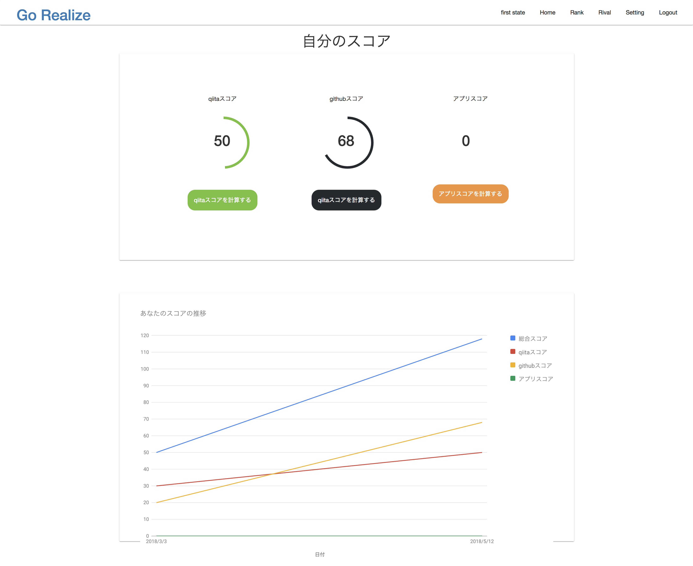
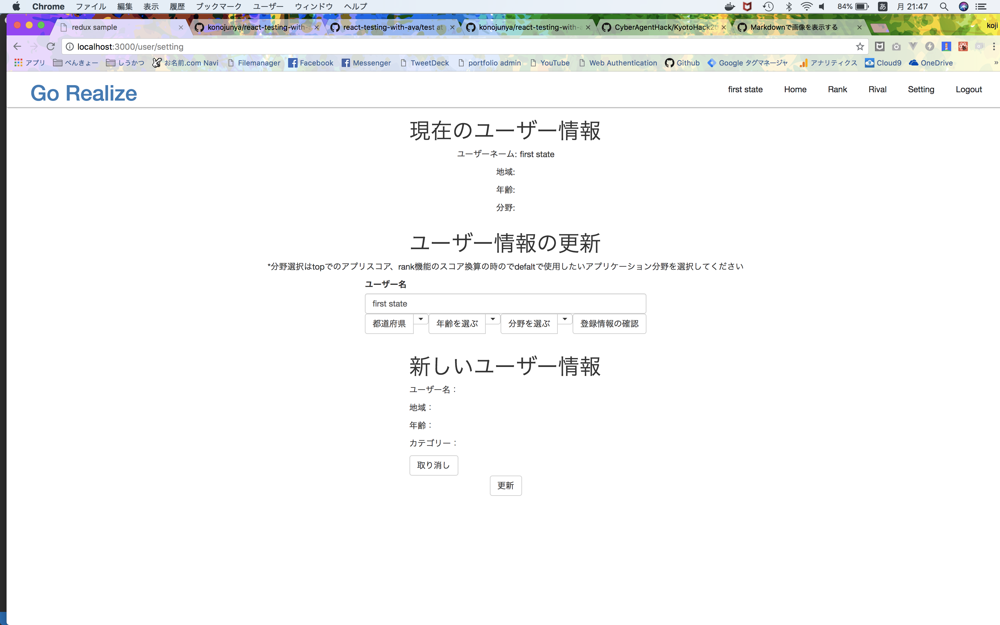
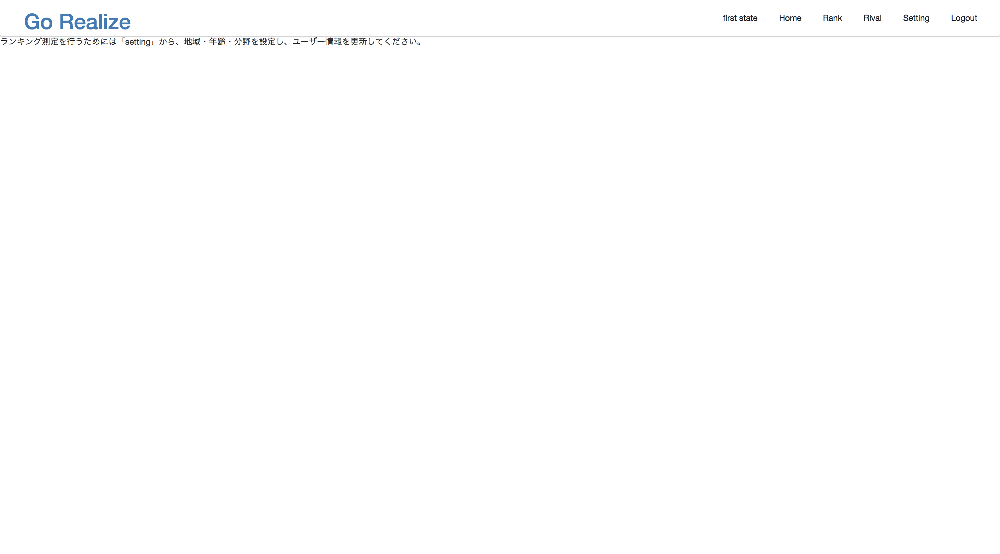
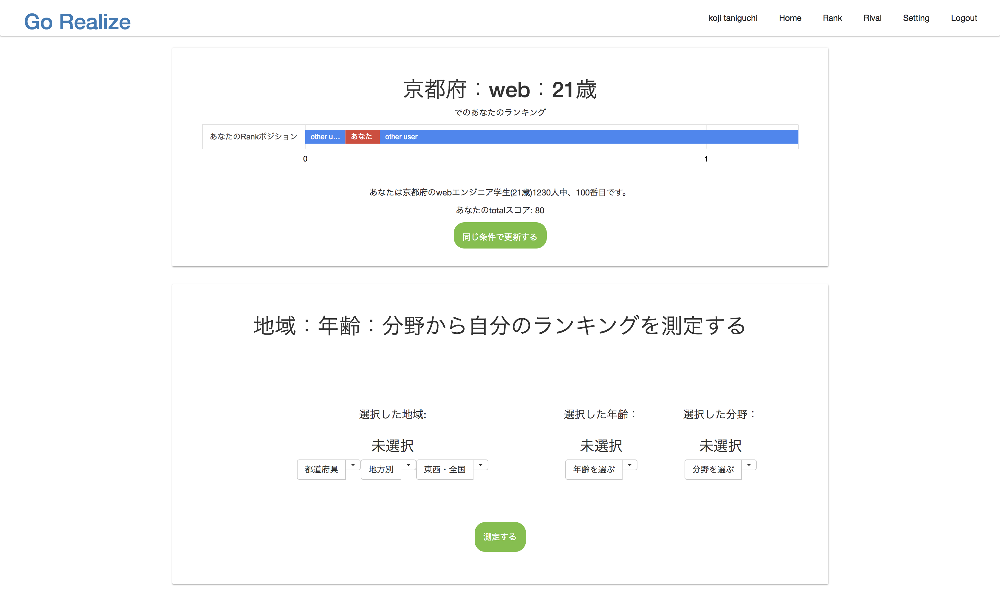
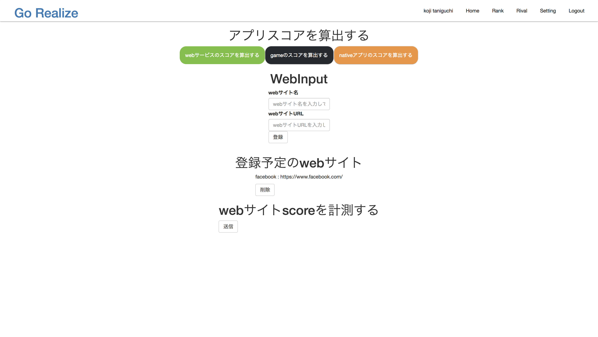

# エンドポイントざっくり概要
# 著 : 谷口浩司
  

---

**以下のエンドポイントでは、基本的にcookieにJWTを乗せてリクエストを行うので、毎回cookieを確認し、JWTのuser_idを元にCRUDを行うこと。**

---

##  GET "/"
  - Goサーバから静的ファイルを配布する
    * index.html
    * javascript/bundle.js
----

##  GET "/github/callback"
  -  リダイレクトURL
  ```
  https://github.com/login/oauth/authorize?client_id=Iv1.d882cbd0a00cefe1
  ```
  -  ユーザーがgithub認証を使ってログインする際のcallback
  -  accesess_token取得に必要な,codeをqueryで習得。
  -  code,client_id,client_secretを用いて以下に POST リクエストし。accesess_tokenを取得。
  ```
  https://github.com/login/oauth/access_token
  ```
  - acsess_tokenを使い、github情報を取得し、DBに**score・ユーザー情報・acsess_token**を保存する。
  - user_idをpayloadに持つ、JWTを生成。CookienにJWT・github認証状態を乗せて「"/"」へリダイレクトする。

  **request(cookie)**
  ```
  { 
    name: JWT, 
    value: hogehoge
    MaxAge: hogehoge
  }
  { 
    name: github, 
    value: Autholization
    MaxAge: hogehoge
  }
  ```
  **qiitaでログイン後の認証の場合、redirectURLのstateにJWTを乗せてリクエストをしているので、JWTをデコードして、user_idを取得し、同じデータベースレコードにacsess_tokenを保存する**

---
##  GET "/qiita/callback"
  - リダイレクトURL
  ```
  https://qiita.com/api/v2/oauth/authorize?client_id=578ca02351facf9f4c535bd7b62d0f2b9a750945&scope=read_qiita
  ```
  -  ユーザーがgithub認証を使ってログインする際のcallback
  -  accesess_token取得に必要な,codeをqueryで習得。
  -  code,client_id,client_secretを用いて以下に POST リクエストし。accesess_tokenを取得。
  ```
  https://qiita.com/api/v2/access_tokens
  ```
  - acsess_tokenを使い、qiita情報を取得し、DBに**score・ユーザー情報・acsess_token**を保存する。
  - user_idをpayloadに持つ、JWTを生成。CookienにJWTを乗せて「"/"」へリダイレクトする。
  - cookieの構造

  ```
  { 
    name: JWT, 
    value: hogehoge
    MaxAge: hogehoge
  }
  { 
    name: github, 
    value: Autholization
    MaxAge: hogehoge
  }
  ```
  **qiitaでログイン後の認証の場合、redirectURLのstateにJWTを乗せてリクエストをしているので、JWTをデコードして、user_idを取得し、同じデータベースレコードにacsess_tokenを保存する**

---
## POST "/user/score"
  - homeページで表示する２つのグラフの情報表示するのに必要。(**このサイトの生命線とも言えるmost important 機能**)
  
  - scoreが円のやつ用・graphが遷移グラフ用
  - JWTをcookieに乗せてリクエストを送るので、cookieから取り出して、user_idでよしなにしてくださいな
  **request**

  ```JSON
    {
      JWT: localJWT
    }
  ```
  - 各スコアの最新の値をscoreに入れる。
   (**初期値でnillの場合は、0を入れて送ってください。**)
  - 推移データは`['日付','総合スコア','qiitaスコア','githubスコア','アプリスコア',]`のように配列に入れる。

  **response**
  ```JSON
    {
      score: {
        qiita: {
          value: 0,
        },
        github: {
          value: 10,
        },
        app: {
          web: {
            value: 30,
          },
          game: {
            value: 0,
          },
          native: {
            value: 0,
          },
        }
      },
      graph: {
        value: [
       // ['日付','総合スコア','qiitaスコア','githubスコア','アプリスコア',]
       // 例  
          ["2018/3/3", 40, 10, 10, 20],
          ["2018/4/19", 100, 30, 20, 50],
          ：
          ：
        ]
      }
    }
  ```

---
## POST "/user/update"
  - github,qiitaで登録したユーザー情報更新(「名前」「地域」「年齢」「分野」)するエンドポイント。
  - rank機能を使うために必須のページ（次のエンドポイントで詳しく説明）
  
  - request後、POST "/user/score"へ再度リクエストを送って、homeページを更新する。

  - 地域情報

  ```
      
    ["北海道","青森県","秋田県","岩手県","宮城県","山形県","新潟県","福島県","茨城県","栃木県","群馬県","埼玉県","千葉県","東京都","神奈川","山梨県","長野県","静岡県","愛知県","岐阜県","富山県","石川県","福井県","滋賀県","三重県","京都府","大阪府","奈良県","和歌山県","兵庫県","鳥取県","岡山県","島根県","広島県","山口県","香川県","徳島県","愛媛県","高知県","福岡県","大分県","佐賀県","長崎県","熊本県","宮崎県","鹿児島県","沖縄県"]

  ```
  - 年齢情報
  ```    
    [6, 7, 8, 9, 10, 11, 12, 13, 14, 15, 16, 17, 18, 19, 20, 21, 22, 23, 24, 25, 26, 27, 28]
  ```
  - 分野情報
  ```
   ["web", "ゲーム", "ネイティブ"]
  ```
  ＊ **各配列のindexに +1 したものを id としてリクエストを行う**


  **request(例)**
  ```JSON
  {
    data: {
          Name: "谷口工事",
          region: { id: 4, name: "京都"},
          age: { id: 12, num: 21},
          category: { id: 1, name: "web"}
        }
  }
  ```
  

---
## POST "/user/rank"
 - ユーザーはgithub・qiitaで初回ログイン後、**地域・年齢・分野**を登録するまで、rank機能が使えない仕様になっている。
 
  (**ユーザーの初回singupのコスト軽減のため最初は入力を求めないが、rank機能は最初に自分の地域・年齢・分野を元にグラフを出すので、必須の入力となっている。スコア算出だけでなく、自分の相対的な位置を把握したいユーザー向け**)
  - **POST "/user/update"** でユーザー情報を更新したユーザーのみがrank機能を使うことができる。
   
  - clientから, region age category をrequestを送るので、ユーザーのランキングを算出して欲しい。

  **request(例)**
  ```JSON
   {
    data: {
          region: { id: 4, name: "京都"},
          age: { id: 12, num: 21},
          category: { id: 1, name: "web"}
        }
  }
  ```

  **response(例)**
  ```JSON 
    {
      data: { 
        // ユーザーのランク
        rank: 900, 
        // allとは条件にマッチした人数の全体
        all: 1230, 
        // ユーザーのtotalscore
        totalScore: 220, 
      }
    }
  ```
---

## POST "/user/info"
 - Reactがmountされる前で、clientのlocalstrageにJWTが保存してある時（**login状態**）にリクエストする。
 - 初回ログイン時は、ユーザー名だけが入った responseになる。
 - **未登録でnillの場合は 空文字列「""」を入れてください**

**response(例)**
```JSON
  {
    Name: "qiita name",
    region: { id: "", name: ""},
    age: { id: "", num: ""},
    category: { id: "", name: ""}
  }
```


## POST "/score/create"
 - アプリケーション情報を元に、scoreを算出し保存するエンドポイント
  

 
**request(例)**
```JSON
  {
    category: "web",
    data: [ {name: "facebook", url: "https://www.facebook.com/"}, ...]
  }
```
  - categoryで分野を指定。dataに登録アプリケーションを配列で格納(以下詳細)

```JSON
// web(例)
{name: "facebook", url: "https://www.facebook.com/"}

// game, native(例)
{name: "tiktok", url: "5000000000"}
```

 -  リクエスト後 **POST "/user/score"** に再度リクエストを送り、home画面を更新することで、グラフにアプリケーションスコアの情報を反映させる